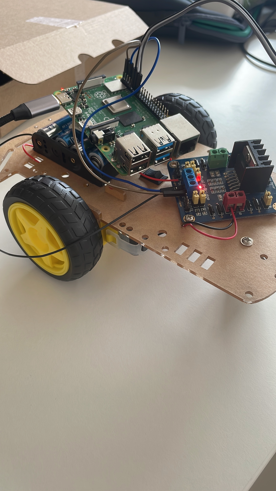

# hygie-bot-hospital

Ce projet implique la création d'un robot contrôlé par un Raspberry Pi, utilisant la bibliothèque GPIO Zero pour piloter des moteurs DC. Le robot est capable de réaliser des mouvements de base tels que avancer, reculer, tourner à gauche, et tourner à droite. Il est aussi capable d'écouter et de reconnaître du son. Il permet ensuite un traitement 

Brief :  Le client a besoin d’un robot assistant pour répondre à la pénurie de médecin dans les hôpitaux. Il dispose déjà d’un robot. 
Cette solution se doit d'être réactive, précise et fiable, intégrant des fonctionnalités avancées de reconnaissance vocale, de traitement du langage naturel, et de navigation autonome. Elle doit aussi être suffisamment automne en termes de batterie pour pouvoir se déplacer d’un point A à un point B et revenir à la base. 

## Table des Matières

- [Installation du composant](#installation-du-composant)
- [Configuration Matérielle](#configuration-matérielle)
- [Utilisation](#utilisation)

## Installation du composant

Pour commencer, vous devez configurer votre Raspberry Pi et installer toutes les dépendances nécessaires. Suivez ces étapes :

### Prérequis

- Raspberry Pi 4 avec Raspberry Pi OS installé.
- Python 3 installé sur Raspberry Pi.
- Accès à internet pour installer des packages.

### Installer les librairies

- GPIO zéro
- pyAudio
- noisereduce
- PyAudioAnalysis 
- CMU Sphinx 
- NLTK

## Configuration Matérielle
Assurez-vous que votre robot est assemblé correctement avec les composants suivants :

- Deux moteurs DC.
- Un contrôleur de moteur (par exemple, L298N ou un Motor HAT compatible avec Raspberry Pi).
- Connexions électriques entre les moteurs, le contrôleur de moteur, et le Raspberry Pi.
- 3 roues (2 connectées au moteur, 1 à l'avant)
- Une batterie externe

Sur l'image, vous pouvez voir le robot partiellement construit. Il manque le capteur et le micro. 

## Utilisation
Une fois le Raspberry Pi configuré et les moteurs connectés, vous pouvez tester les fonctions de déplacement du robot.